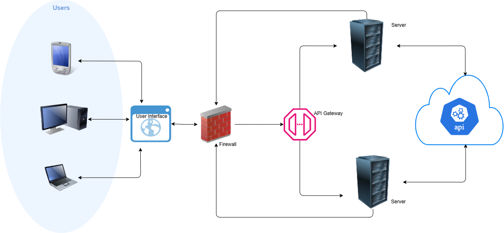

# Jain Hackathon 2024

## High-Level Design



## Demo Video

[Watch the demo video](./Assets/Demo.mp4)

## Project Description

This project is a web application developed using React for the frontend and Node.js for the backend. The following sections describe the steps to run both parts of the application.

## Prerequisites

- Node.js (v14 or above)
- npm (v6 or above)

## Getting Started

### Cloning the repo

   ```bash
   git clone <repository-url>
   ```
### Starting backend
   ```bash
   cd property-backend
   npm install
   node app.js
   https://localhost:8000
   ```

### Starting frontend
   ```bash
   cd property-frontend
   npm install
   npm start
   https://localhost:3000
   ```


