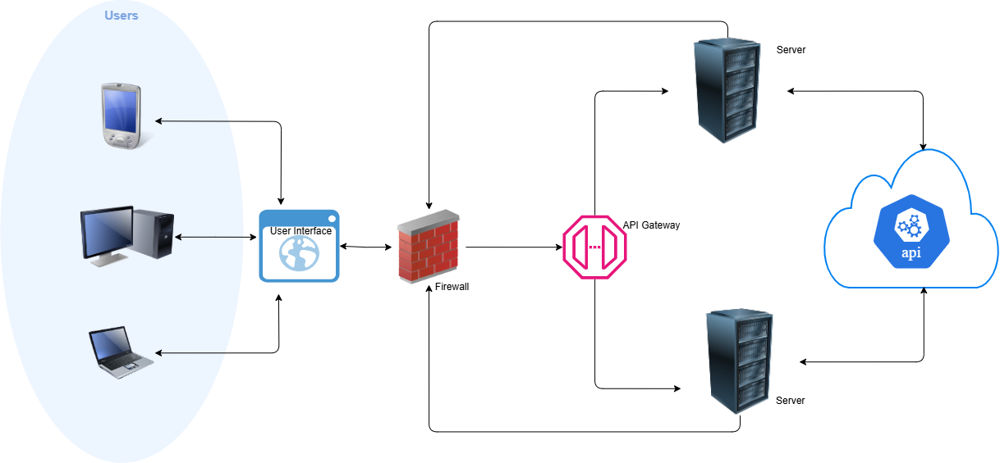

# Project Name

## High-Level Design



## Demo Video

[Watch the demo video](./Assets/Demo.mp4)

## Project Description

This project is a web application developed using React for the frontend and Node.js for the backend. The following sections describe the steps to run both parts of the application.

## Prerequisites

- Node.js (v14 or above)
- npm (v6 or above)

## Getting Started

### Running the Backend (Node.js)

1. **Clone the repository:**
   ```bash
   git clone <repository-url>
   cd <repository-name>
